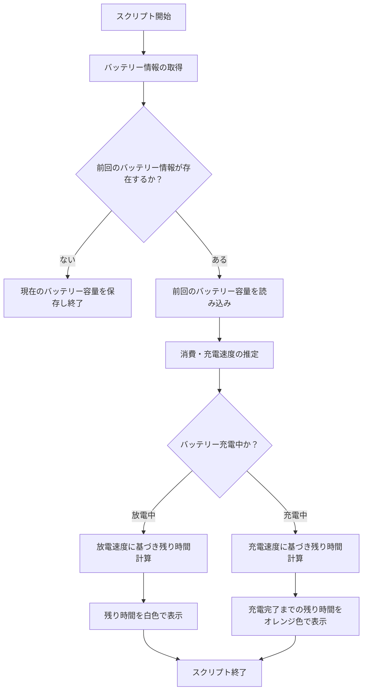

# Battery-Time-xbar

バッテリーの持続時間、充電時間の残り時間をxbarで表示するためのコード

xbarについては以下を参照
https://github.com/matryer/xbar.git

```mermaid

graph TD
    A[スクリプト開始] --> B[バッテリー情報の取得]
    B --> C{前回のバッテリー情報が存在するか？}
    C -- ない --> D[現在のバッテリー容量を保存し終了]
    C -- ある --> E[前回のバッテリー容量を読み込み]
    E --> F[消費・充電速度の推定]

    F --> G{バッテリー充電中か？}
    G -- 放電中 --> H[放電速度に基づき残り時間計算]
    G -- 充電中 --> I[充電速度に基づき残り時間計算]

    H --> J[残り時間を白色で表示]
    I --> K[充電完了までの残り時間をオレンジ色で表示]

    J --> L[スクリプト終了]
    K --> L

```
